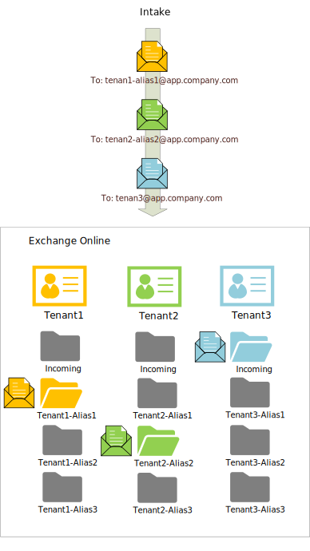

### Overview

The processing of incoming mail of a tenant leverages mail aliases (or _'proxyAddresses'_). Sharing a single mailbox among aliases saves resources since it's not required to assign a dedicated license for each email address. Instead, a dedicated mailbox (a single Azure AD user) is created for every tenant and all email messages for all aliases are directed to the same mailbox.

If there weren’t limitations of Microsoft Graph API, the most straightforward solution would be to use different mail aliases as a discriminator for messages addressed to the same tenant mailbox. Since it's impossible to get alias address (Microsoft Graph API returns the primary mailbox address only), there is a workaround: to create folders in the mailbox and apply rules for incoming mail messages in order to route them to the corresponding folders.

To apply this workaround the next few steps have to be implemented.

Step 1. [Users](users.md)

Step 2. [Aliases](aliases.md)

Step 3. [Messages](messages.md)

